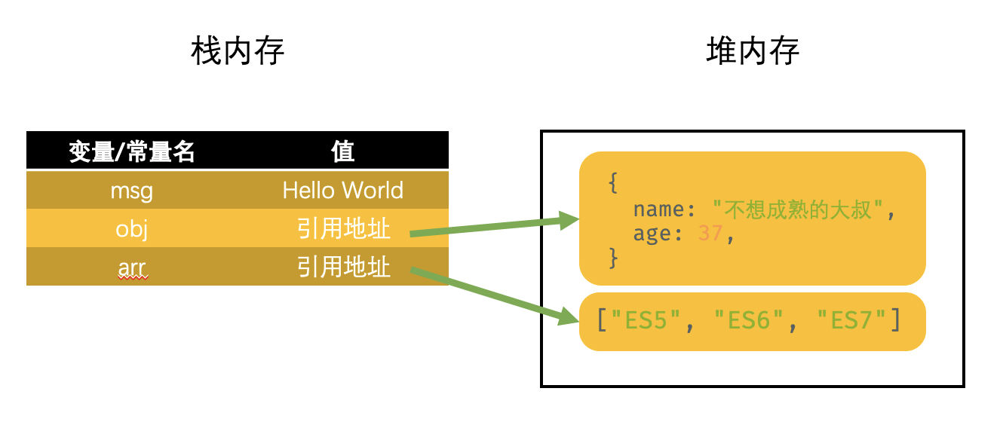

你好，今天大叔想和你聊一聊 ES6 新增的关键字 —— `const`。说 `const` 关键字之前，大叔先和你聊聊大叔自己对 `const` 的感受 —— JavaScript 终于可以声明真正的常量啦！大叔为什么会发出这样的感叹？实在是“天下苦秦久矣”！

话说 long long ago，当初大叔从 Java 技术栈转向前端技术栈，首先要搞定的就是 JavaScript。虽然都说 JavaScript 和 Java 语言有很多的地方是相似的，但你知道直到大叔发现这货不能声明常量时候的感受吗？！那真是欲哭无泪啊~ 一个堂堂的编程语言，居然不能声明常量？！也好意思说自己是个编程语言？！

## 声明常量

好吧~ 大叔不吐槽了，还是说正事儿吧。其实，在 ES5 里面也不是不能声明常量，就是有那么一点点的别扭。你知道 `Object` 有个叫做 `defineProperty()` 的方法吧？它是用来给某个对象定义属性的。在 ES5 里面就可以通过这个方法间接地来声明常量。

比如说你想在全局作用域里面声明一个常量，其实就可以看作是给顶级对象添加一个属性。带入个场景比较好弄明白，假设是一个 HTML 页面里面声明一个全局常量，就可以像下面这样：

```javascript
Object.defineProperty(window, 'a', {
  value: 'a',     // 设置该属性的值
  writable: false // 设置该属性的值不能写
})
```

这段代码的意思就是给 `window` 对象增加一个名叫 `a` 的属性。

```javascript
console.log(a)
```

这时打印的结果比较简单，就是 a。接下来咱们再修改一下试试看是啥结果：

```javascript
a = 'b'
console.log(a)
```

打印的结果还是 a，并没有把 `a` 的值改成 b。因为 `writeable` 的作用就是这个属性能不能写，值为 `false` 表示只能读不能写。所以，这时的属性 `a` 只能访问不能修改。

其实，这样的用法已经很接近常量的用法。但是，你不觉得别扭吗？！为什么？大叔给你说说：

- 现在要声明的是一个常量，用的是定义属性的语法。
- 这个示例还好，因为是声明全局常量，可以加到 `window` 这种顶级对象上。要是在一个函数作用域里面怎么办，找不准上下文对象咋办？！
- 即使就用这个办法能解决这个问题，也确实不能改值。但是，什么提示没有，你不难受吗？！
- 常量就是常量，属性就是属性。至少从概念上就别混淆在一起，你说是不是？！

所以，在 ES6 的新特性里面，大叔终于看到希望 —— `const`。这货才是真正用来定义常量的！说到常量，大叔得先给你科普一下到底怎么样才算是常量。

所谓常量，简单来说就是不能变化的值。其实，不仅不能值变化，还不能重复赋值，也不能重复声明，这才算是对的。

那接下来，大叔就给你看看 `const` 这货能不能做到这一点：

```javascript
const a = 'a'
console.log(a)
a = 'b'
console.log(a)
```

这段代码不难看出就是使用 `const` 关键字声明了一个常量，两处打印的结果分别为：

- 第一处打印的结果是 a
- 第二处打印的结果是报错，报错的内容是：`TypeError: Assignment to constant variable.`，大概的意思就是你把常量当变量赋值了。

看到了吧？！这才是常量。不仅不能改变值，而且会进行报错，告诉你改变值这种行为是不对的。

### 声明常量的注意事项

当然，ES6 新增了这样的语法，附带也有一些需要你注意的事儿 —— 就是在声明一个常量的时候，是必须把常量进行初始化的。不能像声明变量一样，声明和初始化可以分成两个步骤完成，比如说像下面这样做：

```javascript
const a
a = 'a'
```

这段代码运行之后的结果就是给你报错，报错的内容是：`SyntaxError: Missing initializer in const declaration`，大概的意思就是说你在声明常量的时候没给人家初始化。

你看看，整得多明白！钉儿是钉儿，卯儿是卯儿的。

## 块级作用域

再有就是，`const` 不仅提供一个真正可以声明变量的方式，还提供了块级作用域。什么？还不知道呢？！那就去看看大叔写的[《let关键字：ES6新增的var关键字加强版》](https://jinyunlong.cc/books/ecmascript-6-plus-tutorial.html#%E7%AC%AC%E4%B8%80%E5%9B%9Elet%E5%85%B3%E9%94%AE%E5%AD%97%E5%8A%A0%E5%BC%BA%E7%89%88%E7%9A%84var%E5%85%B3%E9%94%AE%E5%AD%97)这篇文章里面关于块级作用域的内容吧。

在这儿，大叔想再次重申一下块级作用域的好处 —— 就是会把之前暴露在全局作用域的一些变量全部限制在一个具体的块级作用域里面。比如说像下面这样的代码：

```javascript
if (true) {
  const a = 'a'
}
console.log(a)
```

这段代码运行后打印的结果是报错，报错的内容是：`ReferenceError: f is not defined`。也就是说，你在一个块级作用域里面声明一个常量，在这个块级作用域之外是没办法访问到这个常量的。

## 暂时性死区（TDZ）

既然聊到 `const` 声明的常量是具有块级作用域的，那就不能不说一下暂时性死区的问题。什么意思？就是说使用 `const` 声明的常量也同样存在暂时性死区的，不信你来看段代码：

```javascript
if (true) {
  console.log(a)
  const a = 'a'
}
```

这段代码运行后的结果是报错，报错的内容还是暂时性死区的错误：`ReferenceError: Cannot access 'a' before initialization`。

存在了暂时性死区，就说明 `const` 声明常量的时候也就不存在什么声明提前的事儿了。这两件事儿，其实说的是一个意思，你可得记明白了。

## 声明常量对象或者数组

聊到这儿，基本上关于 `const` 都聊完了。这货除了可以真正声明一个常量之外，其实没什么可聊的。但是，大叔想问你的问题：如果咱们用 `const` 声明一个对象或者数组，那这个对象的属性或者数组里面的元素能不能修改呢？

想是想不明白的，咱们直接上代码吧，用事实来看看到是个什么情况。比如说咱们先声明一个这样的对象：

```javascript
const obj = {
  name: "不想成熟的大叔",
  age: 37
}
```

大叔今年都 37 啦，但是年轻的心还是有的。所以，大叔想把 `age` 这个属性的值改成 18，就像这样：

```javascript
obj.age = 18
console.log(obj)
```

结果~ 咱们运行代码之后得到的结果就是这样的：

```json
{
	name: "不想成熟的大叔",
  age: 18
}
```

注意啊~ 注意啊~ `age` 属性的值被成功的改成了 18！不对吧？`const` 声明的不是常量吗？常量不是不能改变值吗？这结果也不对啊？

灵魂三连问也没用，事实摆在眼前，咱就得认！但是，为什么会这样？别急，且听大叔给你慢慢道来~

想弄明白这个事儿，咱们就得先聊一聊 JavaScript 的存储结构了。JavaScript 的存储结构有两个，一个叫做“栈内存”，一个叫做“堆内存”。一般情况下，咱们定义的变量或者常量都是存储在栈内存里面的。但是，对象和数组算是 JavaScript 里面比较复杂的一种数据，所以对象或者数组的存储形式是这样的：



知道了这个事儿，你大概就能弄明白为什么上面的代码运行的结果是这样的了。说白了 `const` 声明的对象的值确实不能改变，但是对象的值存储的是一个引用地址，而具体的属性其实是存储在这个引用地址里面，`const` 是没办法限制的。

说到这儿，你是不是想问这样的问题要怎么解决？嗯~ 也能解决的。你还记得 `Object` 提供了一个方法叫做 `freeze()` 吗？这个方法是用来冻结某个对象的。冻结之后不能向这个对象添加新的属性，不能删除已有属性，不能修改该对象已有属性的可枚举性、可配置性、可写性，以及不能修改已有属性的值。所以，利用这个方法来解决上面提到的问题：

```javascript
const obj = {
  name: "不想成熟的大叔",
  age: 37
}
Object.freeze(obj)
obj.age = 18
console.log(obj)
```

这样处理之后，咱们再来看看打印后的结果吧：

```json
{
	name: "不想成熟的大叔",
  age: 37
}
```

问题被完美的解决了！等一下，真的是这样的吗？大叔想继续再操作一下的，比如说像这样的：

```javascript
const obj = {
  name: "不想成熟的大叔",
  age: 37,
  skill: {
    name: "coding",
    year: 15
  }
}
```

什么意思？就是说咱们在声明一个对象的时候，这个对象的属性也同样是一个对象或者数组，那现在的问题就是你利用 `Object.freeze()` 方法还能成功地冻结不？咱们就来试试吧：

```javascript
Object.freeze(obj)
obj.skill.year = 20
console.log(obj)
```

咱们得到的结果实际上是这样的：

```json
{
	name: "不想成熟的大叔",
  age: 37,
  skill: {
  	name: "coding",
    year: 20
  }
}
```

发现还是被修改了~ 这又是咋回事儿呢？这就说明 `Object.freeze()` 方法只能冻结当前对象的属性，但是如果某个属性的值还是一个对象或者数组的话，那就说明这个属性存储的还是一个引用地址，实际的数据是存储在这个引用地址中的。

想要解决这个问题其实也不算难，就是继续利用 `Object.freeze()` 方法来冻结这个值为对象或者数组的属性就行了。就像这样操作：

```javascript
Object.freeze(obj.skill)
obj.skill.year = 20
console.log(obj)
```

这样咱们得到的结果就是：

```json
{
	name: "不想成熟的大叔",
  age: 37,
  skill: {
  	name: "coding",
    year: 15
  }
}
```

也就是说，关于这个问题咱们想一劳永逸地解决掉，可以定义一个函数，把对象作为参数传递进去。然后，这个函数主要利用递归方式把对象中所有值为对象或者数组的属性分别进行冻结，穷尽为止就可以啦！

## 写在最后的话

好了，聊到这儿，ES6 新增的 `const` 关键字所有大叔想和你聊的都聊完了，也希望能对你有所帮助。最后再说一句：我是不想成熟的大叔，为前端学习不再枯燥、困难和迷茫而努力。你觉得这样学习前端技术有趣吗？有什么感受、想法，和好的建议可以在下面给大叔留言哦~